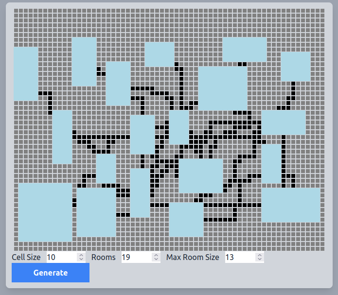

# 2021-12-20 finished N gram

Ok so I think I have a MVP of the N gram page, including a tiny write up. This should be fleshed out, but I think I should try to get a couple more MVPs in place before i do second passes. I should now treat this is an oppurtonity to get the rest of the structure in "MVP" state. I don't think that will be much. Honestly, I can't really argue to do that for the index page until I have more than one page of example content. 

Maybe we focus on a graphic one, next? That will force you to stress test your knowledge of webpacking the various graphics tools you've used in the past. Worst case we just roll our own simple canvas thing. Easy enough? would be fun?

Ok Ideas for next Proc Gen graphics examples:

* L-System Generation
	- 2D and 3D
* Dungeon Generation
* WFC Algorithm

I think the simplest thing to start with would be any of the dungeon generation algorithms. We could start with "guess and check" room placement.

# Working Dungeon Generation.
I have a simple MVP of a dungeon gen working. It uses place-and-check to make rooms, and then uses a random-ish BFS to find paths to connect all the rooms. 

Pretty happy with it. Borrowed some stuff for a few utils. I have links in the source. 

Things I'd like to improve;
* Better look
	- maybe use some image assets?
* Better looking inputs
	- time to make a tailwind component?
	
# Other Projects
 Need to think of the next direction to work in. Try the L-System stuff? idk? maybe just make sure the rest of the work flow makes sense. Tweak project structure? 

 Something you can do on the plane, w.o much need for wifi. So that might mean NOT doing 3D just yet. Or even L-Systems. Might just add content to this, add some explanation to the html. 